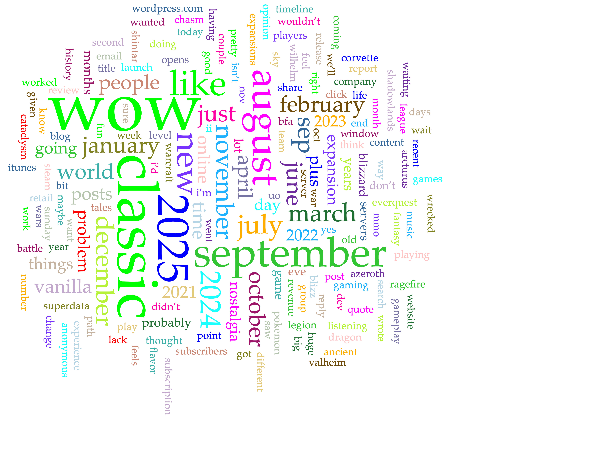
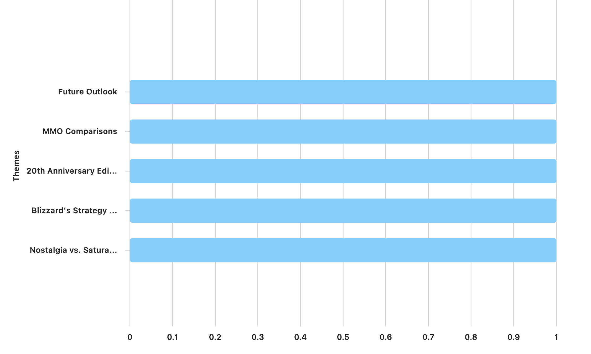

# Distant Reading Assignment 

## Voyant v.s. Copilot

I used Voyant to check out the content of this online article, [Reflections on Five Years of WoW Classic](https://tagn.wordpress.com/2024/08/26/reflections-on-five-years-of-wow-classic/). 

Here is a word cloud Voyant generated for me to give me an overview of the content within the article. At first glance, if you do not read the article it seems that the word cloud is painting a picture of a timeline within the artlce and comparisions to other mmorpgs and some nostalgia factors within the game. 

Then, I took the same article and ran it through Copilot for a synopsis. Here is what Copilot told me: 

"The blog post “Reflections on Five Years of WoW Classic” by The Ancient Gaming Noob offers a personal and insightful retrospective on the journey of World of Warcraft Classic since its launch in 2019. Here's an analysis of its key themes and takeaways:

### Nostalgia vs. Saturation
The author reflects on the emotional pull of Classic WoW, especially the joy of revisiting zones like Elwynn Forest and Westfall. However, they also express a sense of nostalgia fatigue, noting that multiple iterations—like Season of Discovery and Hardcore realms—have diluted the freshness of the original experience.

“There is, without a doubt, some corner of my brain that wants to be in Elwynn Forest... And there is another part… that feels like that need has been sated for now.”

### Blizzard’s Strategy and Pacing
The post critiques and praises Blizzard’s evolving approach to Classic:

Faster progression: The new roadmap suggests tighter pacing between expansions, which the author sees as a mixed blessing.
Parallel progression servers: Blizzard is now running multiple Classic paths simultaneously, which could fragment the player base but also offer more choice.

“It does look like Blizz learned a bit about pacing... less time lingering in expansions, which can be good or can be bad.”

### Mixed Feelings About the 20th Anniversary Edition
The announcement of WoW Classic: 20th Anniversary Edition evokes both excitement and skepticism:

Fresh realms with quality-of-life improvements (e.g., Chronoboon Displacer, improved Honor system).
The emotional tug of starting over is strong, but the author questions whether it’s truly necessary again.

“Wasn’t this all so great back in 2019 and will it be the same and a half a hundred other thoughts all competing for attention…”

### Comparison to Other MMOs
The author draws parallels with EverQuest’s retro servers, noting that WoW’s accessibility makes it easier to jump in and out, while EQ demands more planning and group coordination.

“Leveling in old Norrath is a group effort and a chore... WoW is a bit different.”

### Future Outlook
The post speculates that Blizzard may continue Classic progression all the way to Shadowlands, suggesting a long-term commitment to the Classic ecosystem.

“The plan does look more like Blizz will ride this out to at least Shadowlands.”

### Tone and Style
The writing is conversational, humorous, and self-aware. It balances personal anecdotes with broader commentary on game design and community sentiment. The author’s long history with MMOs adds depth to their reflections.

Would you like a summary graphic or timeline based on this analysis? Or perhaps a comparison between the original Classic launch and the 20th Anniversary Edition?"

I asked it for a summary graphic and what was provided was pitiful. Here it is. I think it is rather pitiful because it does not provide any data of substance, just a copy of the headings from its previous conversation. 

## Final Thoughts 
I think both of these tools are great for specific tasks, but should not be used exclusively when conducting research. When using them to collaborate with one another, you can enjoy their strengths. For example, Voyant is great for providing grabs and data visuals, but it does not give a comprehensive explanation of what the article was about. Copilot was great for breaking down the article and giving me article highlights, but it really flops when asked to do more complex tasks such as creating graphs or when asked to provide a most indepth explanation. 

I think the affordances and constraints of these tools might impact future research in various ways depending on how much reliance is put on them. Lean too heavily and risk forgoing building skills to produce quality research. 
